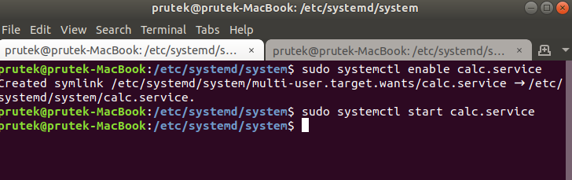
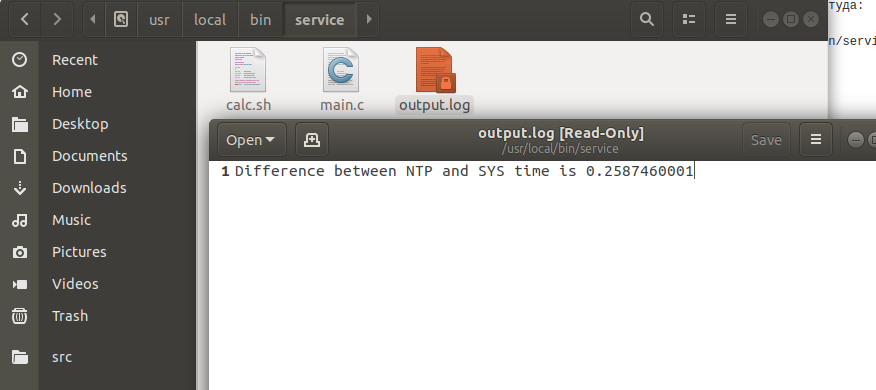

## Задание:
Реализовать мини-сервис оценивающий точность работы часов компьютера.
Сервис должен:
1. Включать синхронизацию системного времени по NTP.
2. Выключать синхронизацию.
3. Выжидать, заранее опеределённое время, запрашивать время по NTP и считать расхождение с системным временем.

## Использование:
1. <b>Перемещение файлов</b>.
<br> Файл calc.service должен лежать в директории с остальными сервисами systemd. Поэтому перемещаем его туда.
<br> Файл calc.sh, скрипт сервиса, и main.c должны находиться в директории service, по пути /usr/local/bin/service/.
```
$ sudo mv [текущие расположение]/calc.service /etc/systemd/system/
$ sudo mv [текущие расположение]/calc.sh [текущие расположение]/main.c /usr/local/bin/service/
```
2. <b>Запуск сервиса:</b>
```
$ sudo systemctl enable calc.service
$ sudo systemctl start calc.service
```
3. <b>Чтение лога из файла output.log:</b>
<br> Difference between NTP and SYS time is 0.476698845

<table>
  <tr>
    <td>
      
    </td>
    <td>
      
    </td>
  </tr>
</table>


## Как работает:
- calc.service - файл, содержит в себе информацию для запуска сервиса через службу systemctl
- main.c - файл, использует UDP для получения данных о времени от сервера, сразу после получения запрашивает системное время и выдаёт разность.
- calc.sh - скрипт, который производит
     - включение сервиса синхронизации системного времени
     - выключение сервиса синхронизации системного времени
     - ожидание заданного времени
     - компиляция и запуск программы рассчета расхождения во времени(main.c)
     - вывод данных в файл(output.log)


